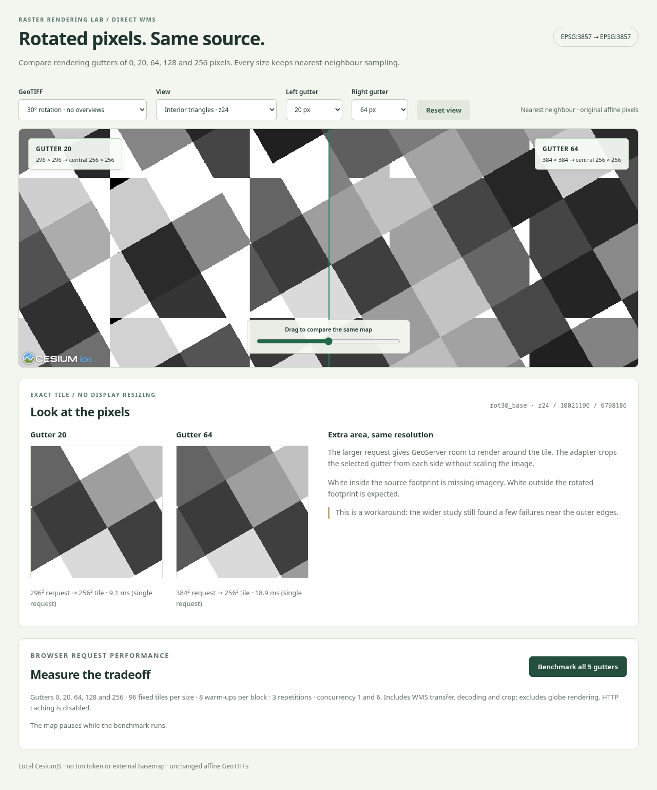

# Cesium direct-WMS gutter demo

A local CesiumJS comparison of **gutters 0, 20, 64, 128 and 256** against the existing, rotated EPSG:3857 GeoTIFFs on stock GeoServer. Choose a size independently for each side of the draggable split view. The demo also includes exact 256 × 256 tile previews, fixture/view selectors, and a browser benchmark for all five sizes.

**Tested result:** gutter 128 removes the interior triangles and preserves nearest-neighbour sharpness. It remains a partial workaround: the full browser matrix reproduces the four footprint-edge request failures from the earlier study. See [RESULTS.md](RESULTS.md) for measurements and limitations.



## Run locally

Requires Node.js **22 or later**. All Cesium assets are served locally; no Ion token, CDN, terrain service, or external basemap is needed after installing dependencies.

From this folder:

```bash
npm ci
npm start
```

Open **http://127.0.0.1:18120/**. The read-only local proxy forwards `/wms` to `http://127.0.0.1:18085/geoserver/wms`, so no GeoServer CORS change is needed. It does not expand requests or crop images: that work happens in the browser adapter.

For an air-gapped machine, install the dependencies on a connected machine first and transfer this folder **including `node_modules`**. Viewing needs Node 22+, the local assets and the reachable GeoServer; Python and Playwright are only needed to rerun automated checks. The included fixture names and transforms describe this study, so another server must publish the same fixtures or supply matching metadata/layer names.

The existing stock benchmark container must be running. In a terminal with Podman available:

```bash
podman --connection podman-machine-default start rasterbench-israel-rgb-5gb-gs
```

From WSL, use the Windows Podman executable if it is not on `PATH`, replacing
`<windows-user>` with the local account name:

```bash
"/mnt/c/Users/<windows-user>/AppData/Local/Programs/Podman/podman.exe" \
  --connection podman-machine-default start rasterbench-israel-rgb-5gb-gs
```

Wait for GeoServer to become ready. The retained `affine_probe` workspace already contains the 14 fixture layers. This demo does not create layers, alter TIFFs, change server settings, or configure GWC. There is no need to run the old benchmark lifecycle helpers or recreate containers. The GDAL worker is only needed for the optional server-version/checksum audit, not for viewing the demo.

Use another WMS endpoint or port with environment variables:

```bash
GEOSERVER_WMS=http://localhost:8080/geoserver/wms PORT=18120 npm start
```

PowerShell equivalent:

```powershell
$env:GEOSERVER_WMS = 'http://localhost:8080/geoserver/wms'
$env:PORT = '18120'
npm start
```

The proxy binds to `127.0.0.1` by default and forwards only GET `GetMap` requests to the configured endpoint. It is a development helper, not a production reverse proxy. A secured deployment should use its normal authenticated same-origin proxy, or configure CORS and authentication explicitly; no credentials are embedded here.

## Using the comparison

1. Start with **30° rotation / no overviews** and **Interior triangles · z24**. Use **Left gutter** and **Right gutter** to choose any pair from **0, 20, 64, 128 and 256 px**; the defaults are 0 and 128. Drag the slider to compare the same map coordinates. Changing a gutter preserves your current pan/zoom.
2. Select **Sharp checkerboard · z24** to inspect the sharp transitions. The two canvases below the map show the same requested tile at its actual pixel dimensions, independently of Cesium's camera and terrain tile selection.
3. Select **Whole footprint · z14**, another rotation, a sheared fixture, nearest overviews, or the north-up control. White outside a rotated footprint is expected background.
4. Click **Benchmark all 5 gutters**. It measures all five sizes using the same 96 requests on `rot30_base`, regardless of the displayed fixture or selected pair. Three repetitions at concurrency 1 and 6 produce **2,880 measured requests**, plus warm-ups, and ten result rows. It pauses the map and disables comparison controls while measuring, then shows request size, median/p95 latency, crop time, throughput and errors. The raw JSON download includes every size and all measured samples.

| Gutter on each side | WMS request | Returned tile |
|---:|---:|---:|
| 0 | 256 × 256 | 256 × 256 |
| 20 | 296 × 296 | 256 × 256 |
| 64 | 384 × 384 | 256 × 256 |
| 128 | 512 × 512 | 256 × 256 |
| 256 | 768 × 768 | 256 × 256 |

Single-request times beside the previews include startup and competing map requests. Use the benchmark table for comparisons.

## How the adapter works

[adapter.js](adapter.js) creates a normal `WebMapServiceImageryProvider` and replaces its public `requestImage` method. For tile bounds `(west, south, east, north)`, tile size `N`, and gutter `g`:

```text
pixelWidth  = (east - west) / N
pixelHeight = (north - south) / N

BBOX = (west - g*pixelWidth, south - g*pixelHeight,
        east + g*pixelWidth, north + g*pixelHeight)
WIDTH = HEIGHT = N + 2*g

Return the central N × N pixels starting at (g, g).
```

At `N=256, g=128`, GeoServer renders **512 × 512** at the original map resolution. The browser crops the centre with a 1:1 canvas copy. It does not scale the image or modify the GeoTIFF.

The implementation explicitly uses **WMS 1.1.1, EPSG:3857, PNG and GeoServer nearest-neighbour interpolation**. White opaque background matches the original study. It forwards Cesium's scheduling/cancellation request and preserves the immediate `undefined` return used for throttling. Images are decoded in their normal orientation before cropping; private Cesium fields are not modified.

To use the adapter in another Cesium application:

```javascript
import { createGutterWmsProvider } from './adapter.js';

const provider = createGutterWmsProvider(Cesium, {
  url: '/your-same-origin-wms-proxy',
  layers: 'your_workspace:your_layer',
  gutter: 128,
  // Prefer the real layer's geographic extent, in radians:
  rectangle: Cesium.Rectangle.fromDegrees(west, south, east, north),
  maximumLevel: 24,
});

viewer.imageryLayers.add(new Cesium.ImageryLayer(provider, {
  minificationFilter: Cesium.TextureMinificationFilter.NEAREST,
  magnificationFilter: Cesium.TextureMagnificationFilter.NEAREST,
}));
```

The geographic `rectangle` limits layer coverage; WMS requests still use EPSG:3857 metre coordinates. Set `maximumLevel` for your own data. This sample handles static imagery and disables feature picking; it does not implement Cesium time-dynamic imagery. It is intentionally specific to this WMS/CRS combination.

Cesium's texture filters and disabled FXAA in the demo avoid extra display smoothing. The exact-tile tests validate the returned raster pixels independently of Cesium's screen rendering. Merely setting `tileWidth: 512`, adding a WMS `gutter` parameter, or setting a GWC gutter does not implement this direct-WMS workaround.

## Reproduce the tests

The adapter's coordinate and request-scheduling tests do not need GeoServer:

```bash
npm test
```

For the full browser check, first prepare reference PNGs from the existing study TIFFs. Run these commands from this folder (Python 3.10+):

```bash
python3 -m venv .artifacts/venv
.artifacts/venv/bin/pip install -r tests/requirements.txt
.artifacts/venv/bin/python tests/prepare.py
npx playwright install chromium
```

On Windows use `.artifacts\venv\Scripts\python.exe` / `pip.exe` instead. Preparing references needs this repository's existing `.runs/affine-probe/evidence/fixtures/` and `fixtures.json`. It verifies all 14 checksums and reads the actual TIFF pixel arrays; it never writes TIFFs. The independent inverse-affine oracle and tile positions are reused from [the earlier study](../docs/rotated-geotiff-study.md).

Start GeoServer and `npm start` in another terminal, then:

```bash
npm run test:browser
```

For a short UI/proxy check without repeating the full matrix or benchmark, run `npm run test:smoke`. Its disposable browser page uses a shortened benchmark list solely to check control locking; it does not replace the recorded performance results.

To validate the five-size controls and run only the full five-size benchmark, use `npm run test:gutters`. This checks every choice on both sides, the actual WMS request dimensions, labels and exact tile previews, preservation of the camera position, locking during benchmarking, and the downloaded JSON. It saves `evidence/gutter-selectors.json`, `performance-all-gutters.json`, screenshots and five exact-tile PNGs. These files preserve the original two-size benchmark evidence.

Optional variables: `DEMO_URL` selects the demo URL; `CHROMIUM_PATH` uses an existing Chromium executable. For example:

```bash
CHROMIUM_PATH=/path/to/chromium/chrome \
  npm run test:browser
```

The browser runner:

- Captures the Cesium triangle, checkerboard, footprint and results views.
- Tests **1,180 requests per gutter** across zooms 14–24 and all 14 fixtures.
- Compares each returned canvas to the independent source/affine reference. It excludes legitimate empty corners from missing-pixel counts and separately reports edge failures.
- Checks interior gap removal, the north-up control, image orientation/alignment and checkerboard sharpness.
- Measures all five gutters on 96 fixed tiles, eight warm-ups per block, three repetitions, concurrency 1 and 6, with rotated/reversed gutter order. The complete pixel-correctness matrix remains the original gutter-0/gutter-128 comparison; the additional sizes are not asserted to pass that matrix.

Generated reference PNGs, raw WMS responses, complete response URLs/headers and proxy timings stay in ignored `.artifacts/`. Curated screenshots and JSON results live in [evidence/](evidence/). A repeat run replaces its current curated results and response index; the proxy timing log appends. The original `performance.json` and `cesium-results.png` remain the dated two-size baseline; new benchmark output goes to `performance-all-gutters.json` and `cesium-all-gutters-results.png`. This is direct WMS: there are no GWC MISS/HIT measurements.

## Files and cleanup

| File | Purpose |
|---|---|
| `adapter.js` | Reusable request-expansion/crop adapter |
| `app.js`, `index.html`, `style.css` | Interactive comparison and benchmark |
| `server.mjs` | Local static server and fixed-upstream, read-only WMS proxy |
| `fixtures.json`, `cases.json` | Source metadata and deterministic request matrix |
| `tests/` | Unit checks, reference preparation and real-browser runner |
| `RESULTS.md`, `evidence/` | Measured outcome, raw result JSON and screenshots |

Stop the demo with Ctrl+C. If GeoServer was stopped before your session, restore that state with:

```bash
podman --connection podman-machine-default stop --time 30 rasterbench-israel-rgb-5gb-gs
```

The implementation session restored the original stopped container state and left the fixtures and WMS settings unchanged; see the restoration evidence in `evidence/`.

## References

- [Cesium WMS imagery provider](https://cesium.com/learn/cesiumjs/ref-doc/WebMapServiceImageryProvider.html)
- [Cesium Resource image loading and request forwarding](https://cesium.com/learn/cesiumjs/ref-doc/Resource.html)
- [Web Mercator native tile bounds](https://cesium.com/learn/cesiumjs/ref-doc/WebMercatorTilingScheme.html#tileXYToNativeRectangle)
- [Cesium imagery filtering](https://cesium.com/learn/cesiumjs/ref-doc/ImageryLayer.html)
- [Underlying GeoServer investigation](../docs/rotated-geotiff-study.md)
