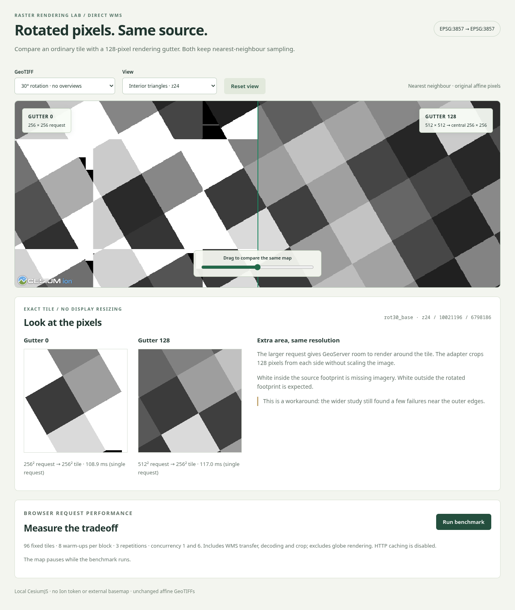

# Browser-tested results

The original two-size baseline below was tested on **2026-10-10** against the original stock GeoServer. The updated demo adds five-size selectors and a separate benchmark; see [the selector update](#five-size-selector-update). No GeoServer source patches, global setting changes, GWC configuration changes, or TIFF edits were applied.

## Outcome

The adapter works in Cesium: **gutter 128 removes the interior triangles and preserves sharp nearest-neighbour pixels**. Browser validation reproduces the same remaining edge limitations as the Python study. It is a useful stock-server workaround, not a complete fix for every edge request.

- The left map uses gutter 0; the right uses gutter 128. Dragging the demo slider compares the same map coordinates.
- The lower previews are the exact same tile at 256 × 256, without screen resizing. They bypass globe texture mapping and camera tile selection.
- [Checkerboard screenshot](evidence/cesium-checkerboard.png), [whole-footprint screenshot](evidence/cesium-footprint.png), and [completed benchmark screenshot](evidence/cesium-results.png) are also retained.

## Environment

| Component | Observed value |
|---|---|
| GeoServer / GeoTools / GWC | 3.0.1 / 35.1 / 2.0.1 |
| Server | Retained `rasterbench-israel-rgb-5gb-gs`, Windows Podman, port 18085 |
| Server limits | 4 CPUs, 8 GiB memory; unchanged benchmark container |
| CesiumJS | 1.146.0, locally served npm build |
| Browser / automation | Chromium 145.0.7632.6 / Playwright 1.58.2 |
| Browser rendering | Headless Linux Chromium on WSL; ANGLE/SwiftShader WebGL 2 |
| Screenshot viewport | 1280 × 1150 CSS pixels, device scale factor 1 |
| Request path | Chromium → local Node proxy → Windows-host GeoServer direct WMS |
| WMS | 1.1.1, EPSG:3857, PNG, nearest neighbour, antialias off, opaque white background |
| Dataset | Same 14 immutable 4096² grayscale TIFFs, including north-up, rotated and sheared grids, with/without nearest overviews |

The browser loaded no external URLs during the UI smoke test. The Cesium logo is local; no Ion token or online imagery is used. Detailed runtime and server evidence is in [browser.json](evidence/browser.json), [server-before.json](evidence/server-before.json), and [initial-state.json](evidence/initial-state.json).

## Pixel correctness and sharpness

The independent inverse-affine oracle reads the existing TIFF arrays and evaluates output pixel centres. Expected coverage comes from the rotated source footprint, not its axis-aligned envelope. White/black/transparent pixels count as defects only where valid source values should exist.

The matrix covers **1,180 tiles per gutter**, zooms 14–24, every fixture and deterministic interior/edge positions. It includes 658 fully covered tiles per gutter.

| Browser adapter | Requests | Failed requests | Missing pixels in successful tiles | Missing pixels in fully covered tiles |
|---|---:|---:|---:|---:|
| Gutter 0 | 1,180 | 2 | 3,980,676 | 3,645,102 |
| Gutter 128 | 1,180 | 4 | 16 | 0 |

Neither gutter has an interior request failure. Both north-up controls have zero missing pixels. Failed requests are counted separately from missing pixels; the four gutter-128 failures are **not** merely four omitted pixels.

The minimal `rot30_base` tile `z24 / 10021196 / 6798186` has **29,022 missing pixels with gutter 0**, and **zero with gutter 128**. The gutter-128 texture matches 99.9847% of reference values exactly; mean absolute error is 0.00787 gray levels. This also checks orientation and geographic alignment of the cropped browser canvas.

The checkerboard tile `z24 / 10021003 / 6797199` has **zero missing pixels, zero intermediate gray levels, and 99.9954% exact source matches** with gutter 128. Its mean absolute error is 0.00732. The few differing samples are at nearest-sampling boundaries; the crop introduces no blended edge values.

The four failed gutter-128 requests occur on `rot30_base`, `rot30_ovr`, `rotm30_base`, and `rotm30_ovr`, at footprint-edge positions at zoom 20. These are the same failures as the original study. Accepting a few missing outer-edge pixels does not automatically make a failed tile acceptable in an application. The 16 remaining missing pixels in successful responses are separate isolated edge omissions.

Full per-request results, including failures and pixel statistics: [validation.json](evidence/validation.json). Raw responses and full request URLs/headers remain in `.artifacts/browser-images/` and `.artifacts/responses.json`.

## Browser performance

This measures the actual adapter's complete request path: HTTP transfer through the local proxy, image decoding, and central canvas crop. It excludes globe drawing, GPU texture upload, interactive frame rate, and oracle calculations. The browser uses software WebGL for visual verification; these timings are not a GPU performance comparison.

For each gutter and concurrency: **96 identical fixed tiles**, **eight warm-ups per block**, **three measured repetitions**, with alternating gutter order. There are **288 measured requests per table row**, plus warm-ups. Median averages the two middle samples; p95 uses the nearest-rank percentile. GeoServer resource limits stay fixed. The map is paused while measuring; no GWC is involved. The proxy returns `Cache-Control: no-store`.

| Gutter | Concurrency | Median ms | p95 ms | Crop median ms | Tiles/s | Errors / requests |
|---:|---:|---:|---:|---:|---:|---:|
| 0 | 1 | 11.75 | 14.70 | 0.10 | 82.6 | 0 / 288 |
| 128 | 1 | 21.25 | 26.40 | 0.10 | 45.7 | 0 / 288 |
| 0 | 6 | 18.80 | 26.80 | 0.10 | 300.7 | 0 / 288 |
| 128 | 6 | 28.30 | 41.50 | 0.10 | 162.9 | 0 / 288 |

At concurrency 1, gutter 128 increases median browser latency by **1.81×** and reduces throughput from **82.6 to 45.7 tiles/s**. At concurrency 6, median latency increases by **1.51×**, with throughput declining from **300.7 to 162.9 tiles/s**. These are browser/proxy measurements and should not be substituted for the earlier worker-only HTTP numbers.

The central crop is approximately **0.1 ms** in both cases. Most of the added cost occurs before cropping, while requesting, rendering and decoding the larger image. A 512² image has four times the requested pixels of a 256² tile; this does not imply four times the latency. Timers have finite precision, and the drawImage timing can include deferred image decoding.

The 96 performance tiles are successful interior requests. They deliberately do not estimate the failure rate of arbitrary edge tiles; use the complete correctness matrix for that. The unbuffered baseline is faster while returning incomplete imagery.

These are **warm-server, small-fixture measurements**, not cold-disk tests, long-duration load tests or production capacity claims. The local proxy also records upstream HTTP duration and response sizes in `.artifacts/proxy.jsonl`; that log includes setup, validation and warm-up requests and is not the pooled benchmark table. CPU use and memory growth were not profiled per treatment in this browser test; only server resource limits were verified.

Raw blocks and samples: [performance.json](evidence/performance.json).

## Validation and preservation

- Three unit tests pass: central pixel-coordinate invariance, invalid gutter rejection, and synchronous throttling/request forwarding.
- Browser validation passes the full matrix's interior checks and the north-up control. Checkerboard values verify sharpness and detect a flipped or shifted crop.
- The UI smoke test checks the comparison slider, fixture/view selectors, north-up canvas equality, disabled controls during benchmarking, narrow layout, local-only browser traffic and proxy restrictions. See [smoke.json](evidence/smoke.json).
- No uncaught browser JavaScript errors occurred.
- All 14 source TIFF hashes and the effective WMS configuration hash were verified before and after. The original server and worker were returned to their initial stopped state. See [restoration.json](evidence/restoration.json).
- The dedicated folder retains the demo, documentation, lockfile, tests, screenshots and measured results. The original study and unrelated repository edits are preserved.

## Five-size selector update

Tested **2026-10-10 06:52 IDT**. The live demo now offers independent **Left gutter** and **Right gutter** selectors with values **0, 20, 64, 128 and 256**. Changing either selector preserves the map camera. Map labels, request dimensions and exact-tile previews update together.

The original failing interior tile (`rot30_base`, z24 / 10021196 / 6798186) was checked through every option on both sides. All output canvases remain 256 × 256. Counts agree between the left and right selectors:

| Gutter | WMS request | Missing pixels in this tile |
|---:|---:|---:|
| 0 | 256 × 256 | 29,022 |
| 20 | 296 × 296 | 8,416 |
| 64 | 384 × 384 | 2,515 |
| 128 | 512 × 512 | 0 |
| 256 | 768 × 768 | 0 |

The 20- and 64-pixel gutters reduce the gap in this example but do not eliminate it. Both 128 and 256 remove it here. This is a single interior reproduction case, not a new full-footprint correctness claim for the additional sizes. The earlier edge limitations remain relevant.

**Benchmark all 5 gutters** measures all sizes regardless of the pair selected for display. It uses the same 96 requests, eight warm-ups per block, three measured repetitions and concurrency 1 and 6. Gutter order rotates and reverses across repetitions. The result has 30 measured blocks, **2,880 measured requests** and ten rows. Latency and throughput count successful images; failures are retained separately in the error column and downloaded samples.

| Gutter | Concurrency | Median ms | p95 ms | Crop median ms | Tiles/s | Errors / requests |
|---:|---:|---:|---:|---:|---:|---:|
| 0 | 1 | 11.50 | 13.30 | 0.10 | 86.0 | 0 / 288 |
| 20 | 1 | 12.70 | 14.60 | 0.10 | 77.7 | 0 / 288 |
| 64 | 1 | 15.90 | 19.10 | 0.10 | 61.5 | 0 / 288 |
| 128 | 1 | 20.20 | 25.00 | 0.10 | 47.5 | 0 / 288 |
| 256 | 1 | 37.60 | 44.10 | 0.10 | 25.9 | 0 / 288 |
| 0 | 6 | 18.00 | 24.10 | 0.10 | 323.0 | 0 / 288 |
| 20 | 6 | 17.80 | 25.80 | 0.10 | 313.2 | 0 / 288 |
| 64 | 6 | 20.70 | 28.10 | 0.10 | 273.5 | 0 / 288 |
| 128 | 6 | 27.00 | 36.40 | 0.10 | 211.1 | 0 / 288 |
| 256 | 6 | 54.25 | 74.70 | 0.10 | 109.8 | 0 / 288 |

All measured requests in the saved final run succeeded. An initial exploratory run encountered one image-load failure whose cause was not isolated; the benchmark retains errors rather than counting them as successful fast tiles. The saved results are observations for this warm local workload, not a reliability guarantee. The map in the test browser is paused during measurement; other browser sessions and host activity are not isolated. These are not cold-disk measurements or an interactive frame-rate test.

The original two-size JSON and screenshots above remain unchanged. Updated evidence:

- [Five-size raw benchmark and samples](evidence/performance-all-gutters.json)
- [Selector, camera-preservation, download and layout checks](evidence/gutter-selectors.json)
- [Completed five-size benchmark screenshot](evidence/cesium-all-gutters-results.png)
- Exact unscaled tile PNGs: [0](evidence/gutter-0.png), [20](evidence/gutter-20.png), [64](evidence/gutter-64.png), [128](evidence/gutter-128.png), [256](evidence/gutter-256.png)

`npm test` and `npm run test:gutters` pass. The browser check exercises every size on both sides, real WMS dimensions, camera preservation, selector locking during measurement, all ten result rows, the downloaded JSON and the narrow layout. The expanded benchmark also handles an all-failed group with empty latency values rather than a formatting exception.

GeoServer and the existing local demo server were kept running for interactive use. No GeoTIFF, server configuration or container image was changed by this UI update. Refresh the open demo page to load the new controls.
