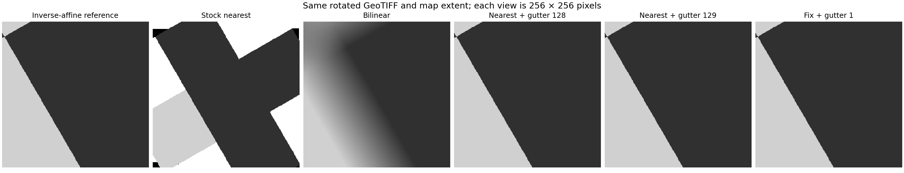

# Rotated GeoTIFF rendering study

Tested locally on 2026-10-09. Source and request CRS: EPSG:3857.

## Result

The white triangles are reproducible on stock GeoServer **3.0.1** and **2.28.5**, with nearest-neighbour interpolation and ordinary GeoTIFF stores. They are not caused by CRS reprojection or by missing source pixels. Nearest-neighbour overviews do not prevent them.

**The best tested configuration-only workaround is a 128-pixel rendering gutter.** It preserves sharpness and removes the interior triangles in this matrix, but four footprint-edge requests still fail. This is a partial solution, even if a few missing edge pixels are acceptable. For direct WMS the client must expand the request and crop it; a GWC gutter has no effect on ordinary direct WMS requests.

An **isolated experimental source correction plus a one-pixel gutter** completes both serving paths without rendering exceptions or interior gaps. Only 16 isolated missing pixels remain near the outer footprint across 1,180 requests per path. This meets the relaxed requirement allowing small edge losses in this matrix. It is not a stock-release fix or a claim of universal correctness.



The original GeoServer image was not modified. Fixtures remained byte-identical. The retained benchmark containers and temporary global settings are restored at the end of the study; test catalogs, images and evidence remain available.

Restoration verification compares effective WMS settings. GeoServer REST materialized five previously omitted defaults (`bboxForEachCRS=false`, `maxRequestedDimensionValues=100`, remote-style limits 60000/30000 ms, and `defaultGroupStyleEnabled=true`). These are recorded explicitly in `config/restoration-verification.json`; the restored XML is therefore semantically equivalent rather than byte-identical.

## Environment and fixtures

| Component | Verified value |
|---|---|
| Baseline | GeoServer 3.0.1, GeoTools 35.1, GeoWebCache 2.0.1, ImageN affine 0.9.2 |
| Baseline image | `docker.osgeo.org/geoserver@sha256:7cb827ba3f6d9fc04a6647fc0cfa6c254fc642407f0d99281fdf026d2540b558` |
| Comparison | Stock GeoServer 2.28.5, GeoTools 34.5, GeoWebCache 1.28.5 |
| Runtime | Windows Podman, baseline port 18085; requests generated inside the retained GDAL worker |
| Per-server limits | 4 CPUs, 8 GiB memory, Java heap 4 GiB |
| Fixture generation | GDAL 3.11.4; deterministic 4096 × 4096, one-band unsigned byte grayscale |
| Affine grids | 1 m pixels; 0°, 15°, 30°, 45°, 75°, −30°; additional sheared 30° case |
| Overview variants | Separate files with no overviews and nearest overviews at 2, 4, 8, 16 |
| Pixel content | Checkerboard, gradients, deterministic texture, narrow lines and sharp edges; values 32–223 |

All 14 TIFFs were prepared once, made read-only, and published through an explicit grayscale style. GeoServer mounted the data volume read-only. SHA-256 verification ran throughout. No north-up conversion, fixture edits or overview rebuilding occurred after preparation. The fixtures occupy approximately 51 MB, so these are warm, small-dataset measurements.

The matrix uses zooms 14–24 and eight deterministic source positions per zoom, deduplicated by output tile. Positions include the centre, different texture regions and points close to all four source edges. This produces **1,180 requests per serving path**, including 658 tiles fully inside the footprint. A dedicated EPSG:3857 GWC grid uses the same full-precision bounds as the independent oracle, avoiding a phase difference from rounded grid bounds. Raw WMS PNGs, WMTS PNGs, URLs, cache headers, errors and masks are retained.

The oracle maps output pixel centres through the inverse six-parameter affine transform, then samples the corresponding source pixel. A missing pixel is counted only inside the real rotated footprint. White/black/transparent responses cannot be confused with valid fixture values. No blanket border tolerance hides defects. Exact-value comparisons also reject images with wrong georeferencing.

## Reproduction evidence

A compact failing request uses `rot30_base`, with SHA-256:

```text
8ef770c3cfe9aa115705f23cb033881f3471057ad9d633b00edf5a9352811c9f
```

Its GDAL geotransform is:

```text
(3897202.3799730493, 0.8660254037844387, 0.49999999999999994,
 3800749.6200269507, 0.49999999999999994, -0.8660254037844387)
```

```bash
curl --get 'http://localhost:18085/geoserver/wms' \
  --data 'service=WMS' --data 'version=1.1.1' --data 'request=GetMap' \
  --data 'layers=affine_probe:rot30_base' --data 'styles=' \
  --data 'srs=EPSG:3857' \
  --data 'bbox=3899692.9729387276,3798970.4675730728,3899695.3615958616,3798972.856230207' \
  --data 'width=256' --data 'height=256' --data 'format=image/png' \
  --data 'transparent=false' --data 'bgcolor=0xFFFFFF' \
  --data-urlencode 'interpolations=nearest neighbor' \
  --data 'format_options=antialias:off' --output failure.png
```

This request loses **29,022 of 65,536 expected pixels (44.3%)**. The manifest, complete URL and raw response are in `analysis/minimal-failure.json` and `images/pilot/`. The north-up control is clean. The 30° pilot loses 116,562 pixels across 16 requests, identically on the two stock releases and with/without nearest overviews.

Four adjacent tiles versus a single 512 × 512 WMS image at the same resolution also expose request-boundary dependence. At zoom 24, the four tiles lose 100,697 pixels; the larger single image loses 25,513. Increasing the rendering area helps but a single larger request is not automatically correct.

## Configuration experiments

The following pilot totals use the same 16 interior requests on the 30° fixture. Only the stated factor changes.

| Setting | Missing pixels |
|---|---:|
| Stock nearest | 116,562 |
| Advanced projection handling off | 116,562 |
| Map wrapping off | 116,562 |
| Both on | 116,562 |
| WMS `buffer=256` | 116,562 |
| Duplicate layer to bypass the direct raster fast path | 116,559 |
| Expanded WMS, gutter 20 | 64,063 |
| Expanded WMS, gutter 64 | 4,305 |
| Expanded WMS, gutter 128 | 0 |
| Expanded WMS, gutter 256 | 0 |

| GWC gutter | Metatile 1 × 1 | Metatile 2 × 2 | Metatile 4 × 4 |
|---:|---:|---:|---:|
| 0 | 116,562 | 43,464 | 32,467 |
| 20 | 64,063 | 26,149 | 24,098 |
| 64 | 4,305 | 366 | 0 |
| 128 | 0 | 0 | 0 |
| 256 | 0 | 0 | 0 |

The zeroes in this pilot are not sufficient to declare success. Full validation follows.

| Full matrix, per serving path | PNGs / 1,180 | Failed requests | Missing pixels | Missing in fully covered tiles |
|---|---:|---:|---:|---:|
| Stock nearest, WMS and GWC separately | 1,178 | 2 | 3,980,676 | 3,645,102 |
| Stock bilinear, WMS | 1,170 | 10 | 162,484 | 4,716 |
| Gutter 128, expanded WMS and GWC separately | 1,176 | 4 | 16 | 0 |
| Gutter 256, GWC | 1,176 | 4 | 24 | 0 |
| Gutter 129, expanded WMS and GWC separately | 1,174 | 6 | 20 | 0 |
| Experimental crop correction alone | 1,178 | 2 | 1,712 | 1,536 |
| Crop + clipping correction, gutter 0 | 1,180 | 0 | 1,714 | 1,536 |
| Crop + clipping correction, gutter 1 | 1,180 | 0 | 16 | 0 |

The gutter-128 residual pixels are isolated: at most one missing pixel in an affected successful tile. However, the four failed requests are separate defects, not four missing pixels. Gutter 129 clears previously failing positions but creates failures elsewhere, including requests within the source footprint. Increasing or slightly changing a gutter is not a reliable cure for the array-boundary bug.

The GeoTIFF reader exposes `InputTransparentColor`. Setting it to black, a value absent from these fixtures, was also tested with gutter 128. It did not remove the exceptions and is rejected. This setting was cleared afterward.

A single-file ImageMosaic superficially gives zero missing pixels but renders the rotation incorrectly. It fails the independent geometry/value comparison and is rejected. The exact reader source constructs a scale-and-translate transform from the indexed envelope. See [GeoTools 35.1 GranuleDescriptor](https://github.com/geotools/geotools/blob/35.1/modules/plugin/imagemosaic/src/main/java/org/geotools/gce/imagemosaic/GranuleDescriptor.java#L450).

The legacy advice to disable JAI-EXT is inapplicable to these releases: GeoServer 2.28 already switched to ImageN and removed that choice. See the [2.28 upgrade notes](https://docs-archive.geoserver.org/stable/en/user/installation/upgrade.html#java-17-and-imagen-geoserver-2-28-0).

## Why this happens and what the source correction changes

Two issues were isolated:

1. `GridCoverageReaderHelper.cropCoverage` crops in map coordinates before enlargement. For a rotated source, the crop becomes a source-grid region of interest. Nearest sampling at high enlargement exposes the quantized region as triangular gaps. Bypassing this premature crop for a same-CRS, rotated/sheared grid with nearest interpolation removes the triangles. Other read paths retain their original behaviour. The reader still selects a bounded source window.
2. The separate edge exception is `ArrayIndexOutOfBoundsException` in `AffineNearestOpImage.byteLoop`, line 396 in ImageN 0.9.2. `AffineOpImage.performScanlineClipping` treats an exclusive upper source bound as inclusive. The patch corrects the forward/reverse endpoint rounding and represents an empty intersection as empty. A Java regression fails on the original library and passes on the correction.

The first finding is supported by controlled rendering experiments and the exact release source; the second has a captured exception stack and a direct library regression. Source references: [GeoTools reader helper](https://github.com/geotools/geotools/blob/35.1/modules/library/render/src/main/java/org/geotools/renderer/lite/gridcoverage2d/GridCoverageReaderHelper.java), [ImageN nearest byte loop](https://github.com/eclipse-imagen/imagen/blob/0.9.2/modules/affine/src/main/java/org/eclipse/imagen/media/affine/AffineNearestOpImage.java#L394), and [ImageN scanline clipping](https://github.com/eclipse-imagen/imagen/blob/0.9.2/modules/affine/src/main/java/org/eclipse/imagen/media/affine/AffineOpImage.java#L726).

Padding only the final renderer crop did not help. Adding padding in the helper constructor or skipping the later renderer crop did not improve the intermediate patch. Those unsuccessful variants are retained for evidence but are not the proposed correction.

Without a gutter, the combined correction leaves a one-pixel row on a few tile edges. A one-pixel gutter removes those rows; the remaining 16 pixels lie near the outer image footprint. This is the explicitly qualified edge-loss result, not a zero-loss result. The patches were built against GeoTools 35.1 and ImageN 0.9.2 and tested in an isolated GeoServer 3.0.1 image. Do not copy the GeoTools JAR into 2.28.5. No source patch was deployed to the benchmark server.

## Sharpness

The visual comparison uses a two-level checkerboard request at zoom 24. Bilinear creates **29,337 intermediate-value pixels**, with mean absolute error 19.35 gray levels against nearest sampling. Gutter-128 nearest creates **zero intermediate levels**, with 99.9954% exact source matches and mean absolute error 0.0073. The few nearest mismatches are sample-boundary/coordinate precision differences, not blurred transitions. The experimental correction retains nearest-neighbour sampling.

The corrected renderer with gutter 1 has the same 99.9954% exact match and zero intermediate levels in that request. In the full matrix, its residual omissions are at most one pixel per affected tile and within 2.06 source-grid pixels of the outer footprint. None occur in the 658 fully covered tiles per path.

## Performance and ranking

The benchmark uses 96 fixed visible tiles across zooms 20, 22 and 24 on `rot30_base`, with eight warm-up requests before each block, three measured repetitions, and concurrency 1 and 6. There are 288 measured responses for each table cell. Request order alternates between repetitions. GWC misses are explicitly truncated and use distinct metatiles; hits are preseeded. Every miss cell has 288 `MISS` headers and every hit cell 288 `HIT` headers. All performance runs have zero response errors. Boundary failures are counted separately in the correctness matrix.

Latency is pooled across the three repetitions; throughput is requests divided by summed measured block duration. HTTP timings include response transfer, and the runner checks PNG type/signature/dimensions. Offline oracle calculations are excluded from the reported HTTP benchmark. Older exploratory runs that included client image analysis are preserved but excluded here.

| Treatment / path | Concurrency 1: median / p95 ms | Requests/s | Concurrency 6: median / p95 ms | Requests/s |
|---|---:|---:|---:|---:|
| Stock nearest, direct WMS | 7.91 / 10.29 | 117.0 | 8.20 / 24.37 | 584.7 |
| Stock bilinear, direct WMS | 14.67 / 52.58 | 55.9 | 15.25 / 61.45 | 245.5 |
| Stock nearest, GWC miss | 8.54 / 10.69 | 108.6 | 9.12 / 33.33 | 478.3 |
| Stock nearest, GWC hit | 0.96 / 1.15 | 960.7 | 4.84 / 9.04 | 1,082.1 |
| Gutter 128 nearest, expanded WMS | 17.24 / 22.60 | 54.2 | 19.76 / 46.17 | 240.3 |
| Gutter 128 nearest, GWC miss | 17.33 / 21.56 | 55.1 | 17.79 / 49.44 | 248.5 |
| Gutter 128 nearest, GWC hit | 0.93 / 1.16 | 989.0 | 4.50 / 8.78 | 1,152.6 |
| Correction + gutter 1 nearest, expanded WMS | 4.07 / 5.80 | 233.8 | 4.82 / 9.38 | 937.4 |
| Correction + gutter 1 nearest, GWC miss | 5.07 / 6.73 | 192.6 | 5.22 / 10.23 | 914.1 |
| Correction + gutter 1 nearest, GWC hit | 1.02 / 1.42 | 831.4 | 4.40 / 8.36 | 1,182.9 |

CPU and memory were sampled from the target container's cgroup approximately every 0.7 seconds. These are totals over each complete benchmark bundle, including its warm-ups, cache operations and bilinear control blocks; short individual blocks are too brief for reliable per-cell resource attribution.

| Bundle | Observed duration s | CPU seconds | Average CPU cores used | Peak cgroup memory MiB |
|---|---:|---:|---:|---:|
| Stock | 19.11 | 21.86 | 1.14 | 5,454 |
| Gutter 128 | 26.55 | 33.09 | 1.25 | 5,652 |
| Correction + gutter 1 | 16.81 | 21.69 | 1.29 | 3,534 |

Memory includes cgroup-accounted cache and depends on each JVM's earlier workload; these numbers do not establish a memory-efficiency improvement. All servers had identical resource limits. The measurements use a warm, small dataset and an internal container network. They are **not cold-disk measurements**, long-duration load tests, or production capacity estimates. Cache-hit throughput is partly limited by the Python client. The broken stock renderer also omits pixels, so its latency is not an equal-quality baseline.

The ranking is:

1. **If experimental source changes are permitted:** crop + clipping correction, with gutter 1 on both paths. It has no interior gaps or failed requests in the full matrix, retains sharpness, and is the fastest measured valid rendering candidate. The tiny outer-edge losses are explicitly retained in the result.
2. **If source changes remain prohibited:** gutter 128 is the best tested partial workaround. It costs about 2.2× stock-nearest median direct-WMS latency at concurrency 1, while cache-hit latency is essentially unchanged. Accept it only where the remaining boundary failures are operationally tolerable; accepting a few edge pixels alone does not make those failures disappear.
3. **If the client cannot expand WMS requests:** GWC-only gutter changes provide only a GWC improvement. A metatile 4 × 4 with gutter 64 passed the interior pilot, but was not promoted to a full-matrix solution. Stock bilinear is blurred and also fails some full-matrix cases, so it is not recommended for this requirement.

No tested stock release/configuration gave a complete, sharp fix for unexpanded 256 × 256 direct WMS and GWC together. The source patch with gutter 0 does avoid exceptions but retains several one-pixel tile-edge rows; that may be acceptable under a looser seam requirement, but gutter 1 is the validated preferred candidate.

## Applying the configuration workaround

A gutter is extra rendering area around a tile, discarded after rendering. For a 256-pixel tile and gutter `g`, render `(256 + 2g)²` pixels at the **same map resolution**, expand each BBOX side by `g × resolution`, then keep the central 256 × 256 pixels. Resizing the expanded image back to 256 would change the result and is not this workaround.

At zoom 24, one output pixel is about 0.00933 m while a source pixel is 1 m. A source-grid boundary error can therefore span more than 100 output pixels. This explains why a conventional gutter of 20 was too small here. The tested value 128 is specific to this source/zoom matrix, not a universal setting.

For direct WMS, OpenLayers has a built-in request-and-crop option:

```javascript
new TileWMS({
  url: '/geoserver/wms',
  params: {
    LAYERS: 'workspace:layer',
    FORMAT: 'image/png',
    INTERPOLATIONS: 'nearest neighbor'
  },
  projection: 'EPSG:3857',
  gutter: 128,            // use 1 for the tested experimental correction
  hidpi: false,           // matches the measured 256-pixel requests
  interpolate: false     // avoid client-side smoothing when displaying tiles
});
```

This is a **client change**; sending a WMS `gutter=128` parameter does not implement it. OpenLayers documents the expanded request and ignored border in [TileWMS options](https://openlayers.org/en/latest/apidoc/module-ol_source_TileWMS-TileWMS.html). The harness validates the equivalent request-and-crop mathematics, not a browser integration. Leave direct-WMS integration through GWC disabled for these expanded, non-grid-aligned requests.

For GWC, edit the saved layer configuration after creating the GeoTIFF store/layer through REST. This is a GWC layer setting, not a GeoTIFF store parameter. Preserve the existing document and change only the gutter/metatile elements:

```bash
GS='http://localhost:18085/geoserver'
LAYER='affine_probe:rot30_base'
# Set GS_USER to your administrator username. curl prompts for its password.
curl --fail --user "$GS_USER" "$GS/gwc/rest/layers/$LAYER.xml" -o layer-original.xml
python3 - <<'PY'
import xml.etree.ElementTree as ET
t = ET.parse('layer-original.xml')
r = t.getroot()
g = r.find('gutter')
if g is None:
    g = ET.SubElement(r, 'gutter')
g.text = '128'  # use '1' for the tested experimental correction
m = r.find('metaWidthHeight')
if m is None:
    m = ET.SubElement(r, 'metaWidthHeight')
m.clear()
for _ in range(2):
    ET.SubElement(m, 'int').text = '1'
t.write('layer-gutter.xml', encoding='UTF-8', xml_declaration=True)
PY
curl --fail --user "$GS_USER" -X PUT -H 'Content-Type: application/xml' \
  --data-binary @layer-gutter.xml "$GS/gwc/rest/layers/$LAYER.xml"
```

Invalidate only the affected layer/grid/zoom range before evaluating the result. For the study's single EPSG:3857 grid:

```bash
cat > truncate.json <<'JSON'
{"seedRequest":{"name":"affine_probe:rot30_base","srs":{"number":3857},
"zoomStart":14,"zoomStop":24,"format":"image/png","type":"truncate","threadCount":1}}
JSON
curl --fail --user "$GS_USER" -X POST -H 'Content-Type: application/json' \
  --data-binary @truncate.json "$GS/gwc/rest/seed/$LAYER.json"
curl --fail --user "$GS_USER" "$GS/gwc/rest/seed/$LAYER.json"
```

Wait until the seed-task listing is empty, then request a tile twice and inspect `geowebcache-cache-result: MISS` followed by `HIT`. The test runner does this. For a production grid, substitute its actual SRS and affected zoom range; the study's dedicated grid is not required to use a gutter. Save the original XML for rollback.

## Reproduction and retained assets

The orchestration script reuses the retained benchmark containers without calling destructive benchmark lifecycle helpers. It requires the benchmark's `israel-rgb-5gb` containers, network, data volume and admin secret; a fresh clone must first set up that environment using the [benchmark guide](geoserver-benchmark.md). It finds `podman` or `podman.exe` on `PATH`; set `AFFINE_PODMAN` to the full executable path when needed (for example, the Windows executable from WSL). Commands run from the repository root:

```bash
python3 scripts/affine-probe.py preflight
python3 scripts/affine-probe.py start
python3 scripts/affine-probe.py sync
python3 scripts/affine-probe.py test
python3 scripts/affine-probe.py run prepare
python3 scripts/affine-probe.py run publish
python3 scripts/affine-probe.py run scan --label baseline
python3 scripts/affine-probe.py run experiments
python3 scripts/affine-probe.py run configure --gutter 128 --metatile 1
python3 scripts/affine-probe.py run scan --nearest-only --pad 128 --label repeat-gutter128
python3 scripts/affine-probe.py export
python3 scripts/affine-probe.py restore
```

`scan` resumes an existing label and retains failures; use a new label for a new measurement. `prepare` verifies existing fixtures rather than overwriting them. `publish` resets the study layer cache configuration, so do not run it in the middle of a candidate scan. The generator can also run independently in a Python environment with GDAL, NumPy, Pillow and requests.

Build and test the experimental correction in the retained environment:

```bash
python3 scripts/affine-probe.py start
python3 scripts/affine-probe.py sync
python3 scripts/affine-build-patch.py --clip-bounds
python3 scripts/affine-probe.py clone-start patched5
python3 scripts/affine-probe.py run --base http://affine-probe-patched5:8080/geoserver \
  --root /data/affine-probe/patched5 --fixture-root /data/affine-probe publish
python3 scripts/affine-probe.py run --base http://affine-probe-patched5:8080/geoserver \
  --root /data/affine-probe/patched5 configure --gutter 1 --metatile 1
python3 scripts/affine-probe.py run --base http://affine-probe-patched5:8080/geoserver \
  --root /data/affine-probe/patched5 scan --nearest-only --pad 1 --label repeat-gutter1
python3 scripts/affine-probe.py run --base http://affine-probe-patched5:8080/geoserver \
  --root /data/affine-probe/patched5 regression --pad 1
```

Performance can be repeated with fresh output labels:

```bash
python3 scripts/affine-probe.py benchmark repeat-stock-http rasterbench-israel-rgb-5gb-gs
python3 scripts/affine-probe.py benchmark repeat-gutter128-http rasterbench-israel-rgb-5gb-gs --gutter 128
python3 scripts/affine-probe.py benchmark repeat-patch-http affine-probe-patched5 --gutter 1
python3 scripts/affine-probe.py run analyze
python3 scripts/affine-probe.py export
python3 scripts/affine-probe.py restore
```

Run benchmarks sequentially, without a simultaneous scan/build. Raw per-request timings remain in the `performance-*-http.jsonl` files; the analysis pools them by profile and concurrency. For restoration, `start` records the current invocation's container state; the original study's initial state remains separately preserved.

The builder fetches exact-version source, checks source hashes, compiles against the installed libraries and runs the library regression. It creates a separate image. Existing comparison containers are reused, so a newly modified image requires a separate comparison container to test it. The retained image here is `localhost/affine-probe:35.1-crop-read-clip`, exposed on localhost:18092 while running.

| Asset | Location |
|---|---|
| Worker generator, request runner, tests | `rasterbench/affine_probe.py`, `tests/test_affine_probe.py` |
| Offline analysis and figure generation | `rasterbench/affine_analysis.py` |
| Host bridge and isolated builder | `scripts/affine-probe.py`, `scripts/affine-build-patch.py` |
| Java regression | `tests/java/AffineScanlineRegression.java` |
| Reviewable source patches | `patches/affine-geotiff/` |
| Fixtures, raw PNGs, masks, URLs, errors, config | `.runs/affine-probe/evidence/` |
| Minimal failure and summary data | `.runs/affine-probe/evidence/analysis/` |
| Exact source, patches, compiled JARs and build manifest | `.runs/affine-probe/source/`, `.runs/affine-probe/patch-builds/35.1-crop-read-clip/` |
| CPU and memory samples | `.runs/affine-probe/resources-*-http.jsonl` |
| Initial/restored container state | `.runs/affine-probe/initial-state.json`, `.runs/affine-probe/restored-state.json`, `.runs/affine-probe/final-state.json` |

Large evidence is intentionally ignored by Git but retained locally and in `/data/affine-probe` in the benchmark data volume. Prior benchmark data/results, unrelated repository edits and the stopped benchmark automation are preserved.

The 16-bit, explicit NoData/mask and unequal-axis fallback fixtures were not needed to reproduce the issue and were not added. They, different CRSs, other raster styles, other ImageN operations and wider randomized testing remain outside the validated scope of this experimental patch.
